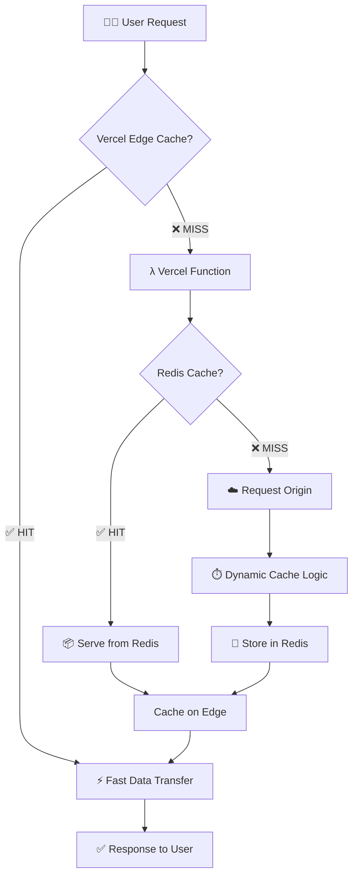

# proxy 

[](https://vercel.com/new/clone?repository-url=https%3A%2F%2Fgithub.com%2FShuakami%2Fproxy)

`proxy` 是一个部署在 Vercel 平台上的高性能、智能缓存的代理系统。

它几乎可以代理任何HTTP请求，包括GET、POST、PUT、DELETE、PATCH等。

得益于多层缓存机制（Vercel Edge Network + Redis）和动态缓存策略，它可以极快的加速对任何公共 URL 的访问，同时显著降低源站负载和带宽成本。

## 工作原理



## 核心特性 ✨

-   **多层缓存**: 结合 Vercel Edge Network 的 CDN 缓存和 Redis 的内存数据库缓存，实现极致的响应速度。
-   **动态缓存算法**: 智能地根据源站的响应速度动态调整缓存时间。源站越慢，缓存时间越长，最大化性能收益。
-   **统计面板**: 提供 `/api/stats` 端点，实时监控代理的运行状态，包括总请求数、缓存命中率、代理流量等。
-   **Git 协议优化**: 能够识别并正确处理 `git` 协议请求，确保 `git clone/fetch` 等操作的兼容性，同时跳过对此类动态请求的缓存。
-   **易于部署**: 只需一个 Vercel 账户和一个 Redis 实例即可轻松部署。


## 部署指南 🛠️

1.  **一键部署**: 点击上方的 "Deploy with Vercel" 按钮，Vercel 将引导您完成仓库克隆和项目创建。

2.  **设置环境变量**:
    在 Vercel 项目的设置中，找到 "Environment Variables" 选项，添加一个名为 `REDIS_URL` 的变量，其值为您 Redis 实例的连接字符串。
    
    *   例如: `redis://:your_password@your_redis_host:your_redis_port`

3.  **完成部署**:
    Vercel 会自动完成部署。部署成功后，您就可以开始使用您的代理了。

## 使用示例 🚀

> 这里的proxy.sdjz.wiki 是我自己部署的服务，你也可以换成你自己的域名


### 1. 加速 `git clone`

您可以通过代理来克隆任何公共 Git 仓库，这在网络不佳时能显著提升下载速度。

```bash
# 克隆本项目
git clone https://proxy.sdjz.wiki/https://github.com/Shuakami/proxy.git
```

### 2. 代理网页或 API

直接在代理地址后拼接上您想访问的完整 URL 即可。

*   **访问网站**:  
    [https://proxy.sdjz.wiki/https://www.example.com](https://proxy.sdjz.wiki/https://www.example.com)

*   **代理原始文件** (例如，查看 GitHub 上的文件):  
    [https://proxy.sdjz.wiki/https://raw.githubusercontent.com/Shuakami/proxy/master/api/index.js](https://proxy.sdjz.wiki/https://raw.githubusercontent.com/Shuakami/proxy/master/api/index.js)

### 3. 加速包管理器下载

您可以临时或永久地为 `npm` 或 `pip` 等包管理器配置代理，以加快依赖安装速度。

*   **NPM 示例**:
    ```bash
    npm config set registry https://proxy.sdjz.wiki/https://registry.npmjs.org/
    ```

*   **Pip 示例**:
    ```bash
    pip install --index-url https://proxy.sdjz.wiki/https://pypi.org/simple/ <package_name>
    ```

## 许可证

本项目基于[AGPL v3](https://www.gnu.org/licenses/agpl-3.0)许可证进行开源。